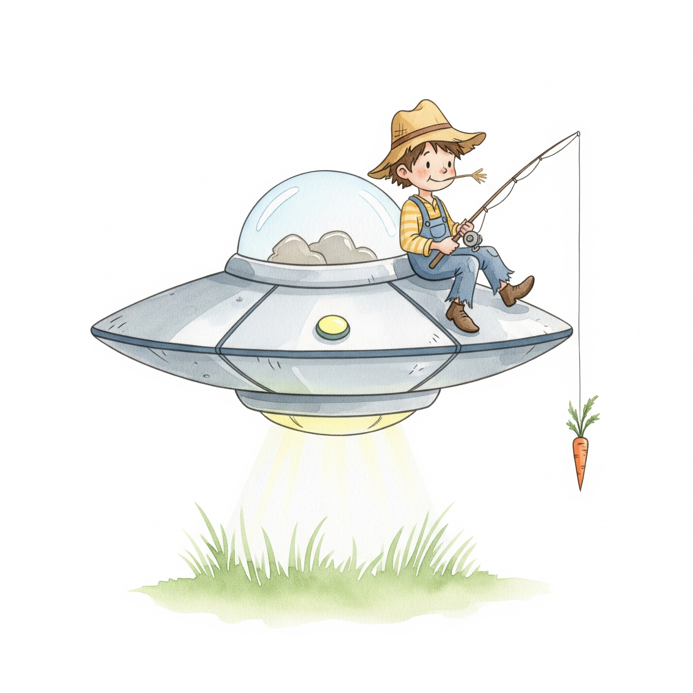

    
    
The Carrot Seller's Cart

    
Tracking Credibility in UFO/UAP Discourse

    

        ⚪⚪⚪⚪⚪ Credible
        →
        🥕🥕⚪⚪⚪ Mixed
        →
        🥕🥕🥕🥕🥕 Carrot Seller
    

    

        <a href="people/">Browse People</a>
        <a href="about/">Methodology</a>
        <a href="about/#contributing">Contribute</a>
        <a href="data/">Download Data</a>
    

---

We provide **objective documentation** of public statements in UFO/UAP discourse. Each person is scored on five criteria: evidence quality, logical consistency, transparency, sensationalism, and monetization ethics. [Learn more →](about/)

All tracked quotes are verbatim with sources, dated and contextualized, fact-checked when possible, and updated with corrections. [Get involved! →](about/#contributing)
